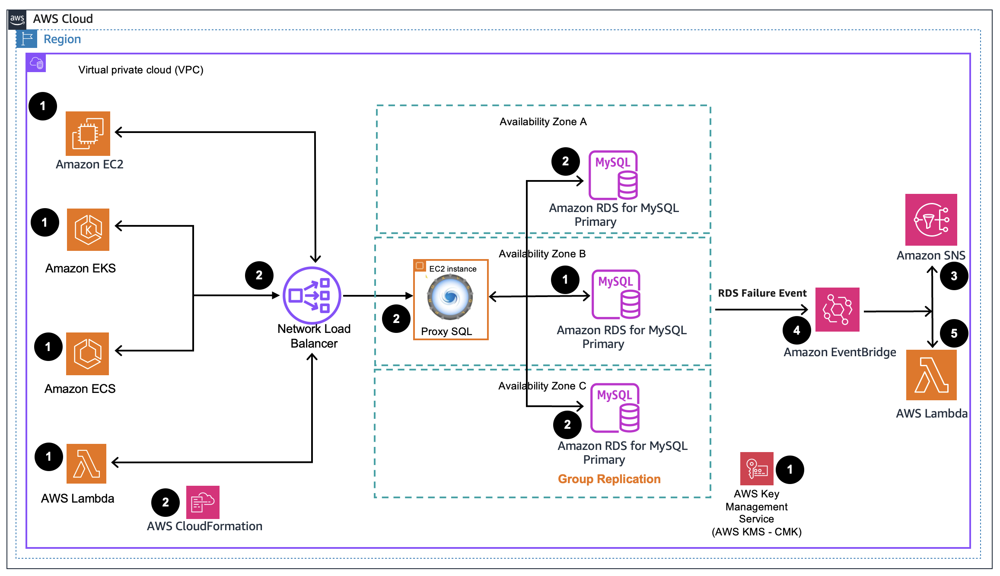
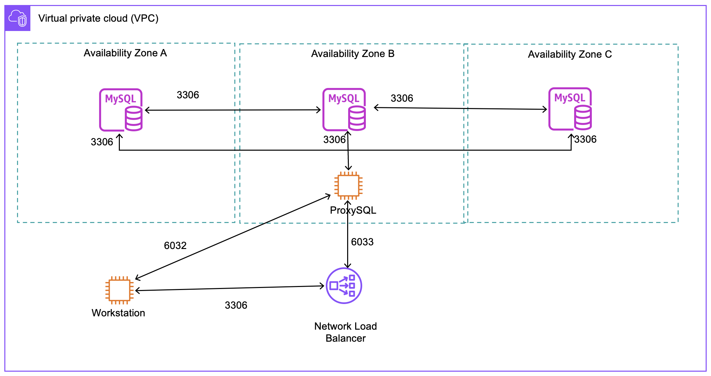

# Guidance for Active/Active Replication on Amazon RDS for MySQL

## Table of Content

1. [Overview](#overview)
    - [Cost](#cost)
2. [Prerequisites](#prerequisites)
    - [Network Prerequisites](#network-prerequisites)
3. [Deployment Steps](#deployment-steps)
4. [Deployment Validation](#deployment-validation)
5. [Cleanup](#cleanup)

## Overview

[Amazon Relational Database Service (Amazon RDS) for MySQL](https://aws.amazon.com/rds/mysql/) supports the Group Replication plugin for active/active replication. You can use the plugin to set up active/active replication between your RDS for MySQL database instances to provide continuous availability for your applications. Writing to two or more database instances in an active/active cluster can help maximize availability and reduce write latency. Using the Group Replication plugin, you can configure active/active replication across up to nine Amazon RDS for MySQL instances. The Group Replication plugin is available on Amazon RDS for MySQL 8.0.35 and higher versions. An active/active cluster set up using the [Group Replication plugin](https://dev.mysql.com/doc/refman/8.0/en/group-replication.html) on RDS for MySQL instances uses group replication in the [Multi-Primary mode](https://dev.mysql.com/doc/refman/8.0/en/group-replication-multi-primary-mode.html). In a multi-primary mode, all instances that are a part of the cluster are set to read-write mode when joining the cluster.

 In today’s fast-paced and highly competitive business landscape, organizations depend on databases and data systems to ensure uninterrupted access to mission-critical applications and services. Setting up active/active replication using Group Replication plugin enables businesses to maintain data consistency and high availability across multiple database instances. Consequently, businesses can achieve **continuous availability**, *minimize downtime*, and deliver seamless user experience to delight end-customers. Active/Active replication using Group Replication is often used for implementing a **follow-the-sun** model for applications. The application can dynamically shift the active primary instance to wherever it is currently daytime, optimizing write performance during peak periods. Further, the reads can be load-balanced across the remaining DB instances to optimize the read latency.

This guide provides a comprehensive overview of Active/Active replication using Group Replication replication plugin for Amazon RDS for MySQL. It covers the reference architectures, planning considerations, and configuration steps for deploying active/active clusters on RDS for MySQL. The guide targets Database Admins, DevOps Engineers, Solution Architects, Business leaders, and Cloud professionals aiming to implement Active/Active cluster topology.

### Cost

You are responsible for the cost of the AWS services used while running this Guidance. As of May 2024, the cost for running this Guidance with the default settings in the N. Virginia AWS Region is approximately **$672.51** per month.

### Sample Cost Table

| AWS service  | Dimensions | Cost [USD] |
| ----------- | ------------ | ------------ |
| Amazon RDS for MySQL  |3 * On-Demand db.r6g.large | $ 470.85 month |
| Amazon RDS for MySQL Storage |3 * (100 GB) gp3, 3k IOPS ,125 MiBps| $ 34.50 month |
| CloudFormation| 1000 third-party extension operations are offered free of charge per month|-|
| Amazon EC2 instance | Linux EC2 On-Demand m6g.large | $ 56.2 month |
| Elastic Load Balancing   |  Network Load Balancer feature  | $ 16.43 month |
| Elastic Load Balancing   | Network Load Balancer TPC+TLS traffic 1 GB per hour| $ 8.76  month|
|AWS Lambda |500,000 requests per month |$ 0 |
|Amazon Simple Notification Service (SNS) |Topic with 500,000 requests per month (Email+SQS+HTTPS) |$ 10.22 month |
|Amazon EventBridge |500,000 custom events per month 1k payload| $ 10 month |
|AWS Key Management Service|1 customer managed Customer Master Keys |$ 7 month|

We recommend creating a [budget](https://alpha-docs-aws.amazon.com/awsaccountbilling/latest/aboutv2/budgets-create.html) through [AWS Cost Explorer](http://aws.amazon.com/aws-cost-management/aws-cost-explorer/) to help manage costs. Prices are subject to change. For full details, refer to the pricing webpage for each AWS service used in this Guidance.

## Architecture

We can configure active/active cluster from scratch or migrate an existing Amazon RDS for MySQL instance to an active/active cluster setup. In this guide, we will configure a 3-node active/active cluster for an existing RDS for MySQL instance.



1. Prerequisites: An existing [Amazon RDS for MySQL](https://aws.amazon.com/rds/mysql/) instance is required to deploy this solution. The application can be running either on the [Amazon EC2](https://aws.amazon.com/ec2/), [Amazon EKS](https://docs.aws.amazon.com/eks/latest/userguide/what-is-eks.html) or [Amazon ECS](https://docs.aws.amazon.com/AmazonECS/latest/developerguide/Welcome.html) or any of your choice. In this solution we assume application is deployed through EC2 instances across multiple availability zones. Amazon RDS for MySQL Instance can be encrypted using default [Amazon KMS](https://docs.aws.amazon.com/kms/latest/developerguide/overview.html) or using [customer managed key (CMK)](https://docs.aws.amazon.com/AmazonRDS/latest/AuroraUserGuide/Overview.Encryption.Keys.html).
2. Once the prerequisites are complete, the [AWS CloudFormation](https://docs.aws.amazon.com/AWSCloudFormation/latest/UserGuide/Welcome.html) stacks are provided as part of this guidance will create resources including additional [Amazon RDS for MySQL instances](https://aws.amazon.com/rds/mysql/) if not exists already, [ProxySQL](https://proxysql.com/) and [Network Load Balancer](https://docs.aws.amazon.com/elasticloadbalancing/latest/network/introduction.html). [Amazon SNS](https://docs.aws.amazon.com/sns/latest/dg/welcome.html) topic [AWS Lambda](https://docs.aws.amazon.com/lambda/latest/dg/welcome.html) function and [Amazon EventBridge](https://docs.aws.amazon.com/eventbridge/latest/userguide/eb-what-is.html) rules are deployed.
3. Amazon CloudWatch alarm is created to generate alarm for [RDS failure event](https://docs.aws.amazon.com/AmazonRDS/latest/UserGuide/USER_Events.Messages.html#USER_Events.Messages.instance) (such as DB instance shutdown, restart, failover, or failure) and notify through Amazon SNS topic.
4. Amazon EventBridge rule is configured for DB instance failure, shutdown, and restart events and notify through Amazon SNS topic when the event occurs and also calls Amazon Lambda function.
5.AWS Lambda function provides a framework to add any additional functionalities during the [RDS failure event](https://docs.aws.amazon.com/AmazonRDS/latest/UserGuide/USER_Events.Messages.html#USER_Events.Messages.instance). Some of the functionalities can be, but not limited to
    - If one of the instance in active/active replication topology is restarted, verify that restarted DB Instance is joined back to the Group replication topology.
    - If one of the instance  in active/active replication topology is upgraded, the DB instance will be in read_only mode. So, upgrade other DB instances in the replication topology.
    - Do periodic health checks using MySQL [performance schema tables](https://dev.mysql.com/doc/refman/8.0/en/group-replication-replication-group-members.html) and if one DB instance is in suspended state, redirect the traffic to other DB instances in the active/active replication topology.

### File Structure

```tree
.
├── README.md
├── assets
│   └── images
├── scripts
│   ├── configure_mysql_gr.sh
│   └── configure_proxysql.sh
└── templates
    ├── ProxySQL-ELB.yaml
    ├── ProxySQL-Instance.yml
    ├── RDS-MySQL-DB-Instance.yml
    ├── RDS-MySQL-DB-Secret.yml
    └── RDS-MySQL-DB-parameter-group.yml
```

**Templates:** The guidance will utilize CloudFormation (CFN) templates for deploying resources. The "templates" directory contains five CloudFormation templates.

1. **RDS-MySQL-DB-parameter-group.yml** - This template creates an RDS for MySQL parameter group, including all the parameters necessary to initiate MySQL Group Replication.
2. **RDS-MySQL-DB-Instance.yml** - This template creates an RDS for MySQL instance. When executed, the template will deploy one DB instance at a time.
    **Note:** If you do not have an existing RDS for MySQL instance as a prerequisite, you can use this template to create your first RDS for MySQL instance.
3. **RDS-MySQL-DB-Secret.yml** -  This template is optional if you already have an RDS for MySQL DB instance. It creates secrets with user and a random password for the DB instance. These secrets can be used for your first DB instance, which you might have created to implement this guidance.
4. **ProxySQL-Instance.yml** - This template creates an EC2 instance running [ProxySQL](https://proxysql.com/).
5. **ProxySQL-ELB.yaml** - This template creates an [Elastic Load Balancer](https://aws.amazon.com/elasticloadbalancing/), which provides high availability and serves as an access point for the ProxySQL instances.

**Scripts:** These scripts will assist in configuring ProxySQL and setting up Group Replication between the RDS for MySQL instances.

1. **configure_mysql_gr.sh** - This script configures MySQL Group Replication.
2. **configure_proxysql.sh** - This script configures ProxySQL. For more information, refer to: [Group Replication Configuration](https://proxysql.com/documentation/group-replication-configuration/)

## Prerequisites

1. Install and configure the latest version of the [AWS CLI (2.2.37 or newer)](https://aws.amazon.com/cli/) and Python 3.10 on the machine you are going to use to interact with. This can be your personal laptop, an Amazon EC2 instance, Cloud9, or similar machine. To access ProxySQL and RDS for MySQL instances Install [MySQL Command-Line Client](https://dev.mysql.com/doc/refman/8.0/en/mysql.html). Set up the AWS credentials for the user who is authenticated to set up the stacks in your AWS Region.
2. To deploy this guidance, ensure that the user has permissions to create, list, and modify resources for Amazon EC2, Elastic Load Balancing V2, AWS Lambda, Amazon SNS, and RDS for MySQL DB instances.
3. An existing RDS for MySQL DB instance with version 8.0.35 and higher. If you don't have an existing DB instance, create a DB instance using the CFN templates (`RDS-MySQL-DB-Instance.yml` and `RDS-MySQL-DB-Secret.yml`).
4. [Enable automated backups](https://docs.aws.amazon.com/AmazonRDS/latest/UserGuide/USER_ManagingAutomatedBackups.html#USER_WorkingWithAutomatedBackups.Enabling) on your DB instance. Set the backup retention period to a positive nonzero value. This determines whether binary logging is turned on or off for DB instance.
5. [Create a DB snapshot](https://docs.aws.amazon.com/AmazonRDS/latest/UserGuide/USER_CreateSnapshot.html) of the DB instance.
6. Ensure that you have a DB Security Group configured to allow Ingress access to the group replication members.
7. If your existing RDS for MySQL DB instance is using the default parameter group, create a [custom parameter group](https://docs.aws.amazon.com/AmazonRDS/latest/UserGuide/USER_WorkingWithDBInstanceParamGroups.html#USER_WorkingWithParamGroups.Creating) with the MySQL8.0 instance family. You can also create this using the CloudFormation template `RDS-MySQL-DB-parameter-group.yml`.
8. Ensure that you have a valid [DB subnet group](https://docs.aws.amazon.com/AmazonRDS/latest/UserGuide/USER_VPC.WorkingWithRDSInstanceinaVPC.html#USER_VPC.Subnets) configured to facilitate the creation of additional RDS for MySQL instances for group replication members.
9. Ensure that you have a valid Amazon EC2 key pair available for deploying the ProxySQL instance. [Create a key pair using Amazon EC2](https://docs.aws.amazon.com/AWSEC2/latest/UserGuide/create-key-pairs.html#having-ec2-create-your-key-pair).

### Network Prerequisites

1. Ensure that the machine you will use to interact with the solution has access to:
    | Component| Port | Description|
    |----------|------------|------|
    | RDS for MySQL instances | 3306 | MySQL SQL port  |
    | ProxySQL | 6032 | ProxySQL Admin port  |
    | ProxySQL | 6033 | ProxySQL SQL port  |
    | ProxySQL EC2 instance | 22 | ProxySQL EC2 ssh port  |
2. A [VPC](https://docs.aws.amazon.com/vpc/latest/userguide/what-is-amazon-vpc.html) with internet access is required for the ProxySQL installation. The ProxySQL CloudFormation stack (`ProxySQL-Instance.yml`) utilizes the public yum repository from the ProxySQL website.
3. A [Security Group](https://docs.aws.amazon.com/vpc/latest/userguide/vpc-security-groups.html) with inbound rules configured for the ports described in #1 of this section.
4. A [Database subnet group](https://docs.aws.amazon.com/AmazonRDS/latest/UserGuide/USER_VPC.WorkingWithRDSInstanceinaVPC.html#USER_VPC.Subnets) for the RDS for MySQL instances.



## Deployment Steps

### 1. Clone the repository

1. Clone this git repository.

    ```bash
    git clone git@ssh.gitlab.aws.dev:db-ssa/rdsmysql-groupreplicaton.git
    ```

### 2. Creating a DB Parameter Group Configured for Group Replication

In this section, we will create a new custom parameter group or update an existing custom parameter group for the RDS for MySQL DB instance. You can either use the same parameter group for all the 3 DB instances, or create a separate parameter group for each instance in the active/active cluster. If you are using separate parameter group for each instance, ensure that the Group Replication configuration parameters are the same in each parameter group, otherwise group replication will fail to start. For ease of demonstration, in this guidance we will use a single parameter group for all 3 DB instances of the active/active cluster.

1. **Scenario 1**: If your DB instance is using the default parameter group, then create a custom parameter group using CloudFormation [`RDS-MySQL-DB-parameter-group.yml`](templates/RDS-MySQL-DB-parameter-group.yml) template.

Here the list of sample parameters along with the description:

| Parameter Name                 | Parameter Description                      | Sample Value                   |
|--------------------------------|--------------------------------------------|--------------------------------|
| StackName                      | Name of the Stack and the name of the parameter group| group-replication-pg   |

2. **Scenario 2**: If your DB instance already has a custom parameter group configured, then update the parameter group with the following group replication parameters using the AWS CLI.

```bash
    aws rds modify-db-parameter-group \
        --db-parameter-group-name [db-parameter-group-name] \
        --parameters "ParameterName=binlog_format,ParameterValue=ROW,ApplyMethod=pending-reboot" \
                    "ParameterName=group_replication_group_name,ParameterValue=9510b991-99b4-11ee-8669-0a9258440a9f,ApplyMethod=pending-reboot"\
                    "ParameterName=enforce_gtid_consistency,ParameterValue=ON,ApplyMethod=pending-reboot"\
                    "ParameterName=rds.group_replication_enabled,ParameterValue=1,ApplyMethod=pending-reboot"\
                    "ParameterName=rds.custom_dns_resolution,ParameterValue=1,ApplyMethod=pending-reboot"\
                    "ParameterName=gtid-mode,ParameterValue=ON,ApplyMethod=pending-reboot"\
                    "ParameterName=slave_preserve_commit_order,ParameterValue=1,ApplyMethod=pending-reboot"
```

Example code snippet:

```bash
    aws rds modify-db-parameter-group \
        --db-parameter-group-name group-replication-pg \
        --parameters "ParameterName=binlog_format,ParameterValue=ROW,ApplyMethod=pending-reboot" \
                    "ParameterName=group_replication_group_name,ParameterValue=9510b991-99b4-11ee-8669-0a9258440a9f,ApplyMethod=pending-reboot"\
                    "ParameterName=enforce_gtid_consistency,ParameterValue=ON,ApplyMethod=pending-reboot"\
                    "ParameterName=rds.group_replication_enabled,ParameterValue=1,ApplyMethod=pending-reboot"\
                    "ParameterName=rds.custom_dns_resolution,ParameterValue=1,ApplyMethod=pending-reboot"\
                    "ParameterName=gtid-mode,ParameterValue=ON,ApplyMethod=pending-reboot"\
                    "ParameterName=slave_preserve_commit_order,ParameterValue=1,ApplyMethod=pending-reboot"
```

3. This list includes the updated parameters needed to enable Group Replication.

**Parameter Name**|**Value**|**Additional Comments**|
|---|---|---|
`binlog_format`|ROW|Setting the value of `binlog_format` to *ROW* is a pre-requisite for group replication to work. The default value for this parameter is set to MIXED.|
`group_replication_group_name`|11111111-2222-3333-4444-555555555555|This UUID is used for generation. You can modify it to use a UUID of your choice. You can generate a MySQL UUID by connecting to a MySQL DB instance and running SELECT UUID() .|
`gtid_mode`|ON|Used by Group Replication to track which transactions have been committed on each server instance. This is a pre-requisite for GR to function.|
`enforce_gtid_consistency`|ON|This is a pre-requisite for Group Replication to function.|
`rds.custom_dns_resolution`|1|This parameter specifies whether to allow DNS resolution from  <br>the Amazon DNS server in your VPC. DNS  <br>resolution must be enabled when group  <br>replication is enabled with the  <br>`rds.group_replication_enabled` parameter.|
`rds.group_replication_enabled`|1|Enables group replication feature on the cluster|
`slave_preserve_commit_order`|ON|This parameter is required to ensure that the correct order of transactions is maintained on each DB Instance, when transactions are executed in parallel|

4. Once you create or modify the custom parameter group, let's apply the updated parameters to the DB instance if they haven't been applied already.

Run the following command, replacing <instance_id> with the actual identifier of the first DB instance

```bash
aws rds modify-db-instance --db-instance-identifier [the name of the source instance] --db-parameter-group-name [parameter group name]
```

Example code snippet:

```bash
aws rds modify-db-instance --db-instance-identifier mysql1 --db-parameter-group-name group-replication-pg
```

5. [Restart the DB instance](https://docs.aws.amazon.com/AmazonRDS/latest/UserGuide/USER_RebootInstance.html) to apply the configuration changes.

> [!IMPORTANT]
> It's important not to skip this step; restarting is necessary to apply the changes made to the DB instance

### 3. Deploying CloudFormation Stack for creating RDS for MySQL DB instances for Active/Active Replication

To set up Group Replication for active/active replication on RDS for MySQL, it's essential to use an odd number of DB instances to ensure a majority can be established, even in the event of a network partition. In this solution, we're setting up a three-node group replication topology. However, you can configure up to nine DB instances for active/active setup. Select the number of DB instances based on your workload and high availability needs.

In this section, we will create RDS for MySQL DB instances to configure Group Replication. If you already have an existing RDS for MySQL DB instance, ensure that you have created a DB snapshot. This snapshot will be utilized to create two additional DB instances using the CFN template [RDS-MySQL-DB-Instance.yml](templates/RDS-MySQL-DB-Instance.yml).

> [!NOTE] 
> If you're starting from scratch with no existing DB instance, you'll need to run the stack three times to create three RDS for MySQL DB instances.

Here is a list of sample parameters along with their descriptions:

| Parameter Name            |  Required   | Parameter Description                      | Sample Value                   |
|---------------------------|--------|--------------------------------------------|--------------------------------|
| StackName                  |  Yes  | Name of the Stack                          | mysql2   |
| NotificationEmailAddress   |  No  | Email address to notify for any alarm      | <mynotificationemail@domain.com> |
| DBSnapshotName             |  No  | DB Snapshot ID to restore database         | mysql1-snap                    |
| SecurityGroupIds           |  Yes  | The ID of the security groups to associate with the instance | sg-0adead7e857d52b3e|
| MySQLDBParameterGroup      |  Yes  | Provide The name of the database parameter group | group-replication-pg|
| DBSubnetGroupName          |  Yes  | Provide The name of the database subnet group |gr-network-dbsubnetgroup-23424 |
| DBInstanceClass            |  No  | Database Instance Class                      | db.r6g.large                        |
| EnvironmentStage           |  No  | The environment tag is used to designate the Environment Stage of the associated AWS resource | dev|
| GroupReplicationName       |  No   | Group replication name - must Be UUID v4 |9510b991-99b4-11ee-8669-0a9258440a9f |
| DBPort                     |  No   |TCP/IP Port for the Database Instance     | 3306                                |
| DBName                     |  No   | Database Name                            | mydb                                 |
| MySQLSecret                |  No   | Provide the ARN of MySQL Secret the Secret need contain password and username keys| arn:aws:secretsmanager:us-east-1:234:secret:RDSMySQLMasterSecret-3-1 |
| DBAllocatedStorage         |  No   | The allocated storage size, specified in GB| 100|
| DBEngineVersion            |  No   | Select Database Engine Version| 8.0.35           |
| RDSKMSCMK                  |  Yes   | Required if DBSnapshotName is empty The ARN of the AWS KMS key that's used to encrypt the DB  instance |arn:aws:kms:us-east-1:012345678910:key/abcd1234-a123-456a-a12b-a123b4cd56ef|
| RDSKMSCMK                  |  Yes   | Required if DBSnapshotName is empty  The ARN of the AWS KMS key that's used to encrypt the DB  instance |arn:aws:kms:us-east-1:012345678910:key/abcd1234-a123-456a-a12b-a123b4cd56ef|
|ReservedConcurrentExecutions| No     |ReservedConcurrentExecutions for notification lambda |  0   |

### 4. Deploying the CloudFormation Stack for ProxySQL Instance

In this section, we will deploy a [ProxySQL](https://proxysql.com/documentation/proxysql-configuration/) instance on Amazon EC2. For this solution, we will need to set up at least one ProxySQL instance using the CFN template [`ProxySQL-Instance.yml`](templates/ProxySQL-Instance.yml).

> [!TIP]
> For enhanced high availability, you can opt to deploy multiple ProxySQL instances across different availability zones by using the parameter *AvailabilityZone* in the CFN template (`ProxySQL-Instance.yml`).

Here is a list of sample parameters along with their descriptions:

| Parameter Name   |   Required   | Parameter Description                      | Sample Value                   |
|------------------|--------------|--------------------------------------------|--------------------------------|
| StackName        | Yes         | Name of the Stack                          | proxysql1   |
| AmiID            | No         | The ID of the AMI.        | /aws/service/ami-amazon-linux-latest/amzn2-ami-hvm-arm64-gp2 |
| AvailabilityZone | Yes         | ProxySQL Availability zone                 | us-east-1a                    |
| EnvironmentType  | No         | Specify the Environment type of the stack.     | prod          |
| KeyPairName      | Yes  | The name of an existing Amazon EC2 key pair in this region to use to SSH into the Amazon EC2 instances.| keypair |
| SecurityGroupId  | Yes       | The ID of the security groups to associate with the instance. |sg-1234455667 |
| SubnetId         | Yes     | The ID of the subnet to associate with the instance notice that SubnetId need to be in the AvailabilityZone you selected  .| subnet-1234556677                    |

### 5. Deploying the CloudFormation Stack for Elastic Load Balancing (ELB)

In this section, we'll set up the [ELB](https://aws.amazon.com/elasticloadbalancing/) by deploying the CloudFormation template [`ProxySQL-ELB.yml`](templates/ProxySQL-ELB.yml).

Here is a list of sample parameters along with their descriptions:

| Parameter Name     |  Required          | Parameter Description                      | Sample Value                   |
|--------------------|------------|--------------------------------------------|--------------------------------|
| StackName          | Yes            | Name of the Stack                          | elb1   |
| EnvironmentType    | No           | Specify the Environment type of the stack. | prod          |
| SecurityGroupId    | Yes           | The ID of the security groups to associate with the ProxySQL instance. |sg-01234567891 |
| SubnetId           | Yes           | The ID of the subnet to associate with the ProxySQL instances. | subnet-0123456789                    |
| VPCId              | Yes           | The VPC ID to associate with the ProxySQL instance. |  vpc-0abc98330d6efghi4|

### 6. Verify DB instance status

In this section, we'll ensure that all the DB instances are in [Available](https://docs.aws.amazon.com/AmazonRDS/latest/UserGuide/accessing-monitoring.html#Overview.DBInstance.Status) status.  

> [!NOTE]
> Before running the command, ensure to rename the parameter group (**`group-replication-pg`**) associated with your DB instances.

```bash
aws rds describe-db-instances --query 'DBInstances[?contains(DBParameterGroups[].DBParameterGroupName,`group-replication-pg`)].[DBInstanceIdentifier,Endpoint.Address,DBInstanceStatus]'
```
Here is an example of the command output: 

```json
    [
        [
            "mysql1-instance-******",
            "mysql1-instance-******.******.us-east-1.rds.amazonaws.com",
            "available"
        ],
        [
            "mysql2-instance-******",
            "mysql2-instance-******.******.us-east-1.rds.amazonaws.com",
            "available"
        ],
        [
            "mysql3-instance-*******",
            "mysql3-instance-******.*******.us-east-1.rds.amazonaws.com",
            "available"
        ]
    ]
```

### 7. Configure Group Replication

In this section, we will establish active/active replication using the Group Replication plugin between the  RDS for MySQL DB instances we've created.

1. Configure the [group_replication_group_seeds](https://dev.mysql.com/doc/refman/8.0/en/group-replication-system-variables.html#sysvar_group_replication_group_seeds). This script creates the group_replication_group_seeds list by querying for all DB instances that use the parameter group named **group-replication-pg** (replace with the name of your parameter group used with your DB instances). The output of this script will be a list of endpoints for all the DB instances that we will configure for active/active replication.

> [!IMPORTANT]
> If you used a different parameter group, replace the `Parameter Group Name` in the script.

```bash
group_replication_group_seeds_list=""
group_replication_group_seeds_list=$(aws rds describe-db-instances --output text --query 'DBInstances[?contains(DBParameterGroups[].DBParameterGroupName,`(Parameter Group Name)`)].[Endpoint.Address]'|sed 's/$/:3306/'|sed ':a;N;$!ba;s/\n/\\,/g')
echo $group_replication_group_seeds_list
```

2. Run the script below to modify the parameter group by adding the `group_replication_group_seeds` parameter with all the DB instance endpoints.

```bash
aws rds modify-db-parameter-group --db-parameter-group-name (Parameter Group name) --parameters ParameterName=group_replication_group_seeds,ParameterValue=$group_replication_group_seeds_list,ApplyMethod=immediate
```

3. Now, establish Group Replication between the DB instances using the script below.Replace `mysql_user`, `mysql_user_password`, and `hostlist` with your DB instance credentials and list of hosts as shown in the example code snippet below.

| Parameter Name                 | Parameter Description                      | Sample Value                   |
|--------------------------------|--------------------------------------------|--------------------------------|
| --user| DB instance user name | administrator   |
| --password| DB instance password | 1234567   |
| --hostlist| List of all DB instance endpoints with comma separated  | **mysql1-instance-****.****.us-east-1.rds.amazonaws.com`,`mysql2-instance-****.****.rds.amazonaws.com`,`mysql3-instance-****.****.us-east-1.rds.amazonaws.com**   |

```bash
/scripts/configure_mysql_gr.sh --user [mysql_user] --password [mysql_user_password] --hostlist [list od DB instance endpoints] 
```

Example code snippet:

```bash
/scripts/configure_mysql_gr.sh --user admin --password Aa123456 --hostlist "mysql1-instance-****.****.us-east-1.rds.amazonaws.com,mysql2-instance-**.****.rds.amazonaws.com,mysql3-instance-****.****.us-east-1.rds.amazonaws.com"
```

The script output should display at least three instances in the Group Replication with the MEMBER_STATE as ONLINE and MEMBER_ROLE as PRIMARY.

```
+---------------------------+--------------------------------------+-----------------+-------------+--------------+-------------+----------------+----------------------------+
| CHANNEL_NAME              | MEMBER_ID                            | MEMBER_HOST     | MEMBER_PORT | MEMBER_STATE | MEMBER_ROLE | MEMBER_VERSION | MEMBER_COMMUNICATION_STACK |
+---------------------------+--------------------------------------+-----------------+-------------+--------------+-------------+----------------+----------------------------+
| group_replication_applier | 90cc446b-f4f0-11ee-b529-060d8cf35b59 | ip-123-4-5-6  |       3306  | ONLINE       | PRIMARY     | 8.0.35         | MySQL                      |
| group_replication_applier | c658c21c-0249-11ef-bf28-028baf46ebdb | ip-123-4-5-7  |        3306 | ONLINE       | PRIMARY     | 8.0.35         | MySQL                      |
| group_replication_applier | f614eee5-0249-11ef-a3e8-0a677df0b641 | ip-123-4-5-8  |        3306 | ONLINE       | PRIMARY     | 8.0.35         | MySQL                      |
+---------------------------+--------------------------------------+-----------------+-------------+--------------+-------------+----------------+----------------------------+
```

### 8. Configure ProxySQL

1. In this seciton, we will create a DB user (monitor). ProxySQL will use these [credentials](https://proxysql.com/documentation/backend-monitoring/) and continuously monitors the health status of the configured DB instances.

To create the DB user, connect to any one of the group replication DB instance.

```sql  
mysql -h[DB instnace endpoint] -u[dbuser] -p[dbuser-password]
```

Once connected, run the below query to create a DB user (`monitor`)

```sql
CREATE USER 'monitor'@'%' IDENTIFIED BY 'monitor';
GRANT USAGE, REPLICATION CLIENT ON *.* TO 'monitor'@'%';
GRANT SELECT on performance_schema.* TO 'monitor'@'%';
```

2. To configure ProxySQL to accept traffic from your applications and route it to DB instances, use the following script. For more information, refer to: [Group Replication Configuration](https://proxysql.com/documentation/group-replication-configuration/)

> [!NOTE]
> This script need access to Port 6032 of the ProxySQL instances

```bash
scripts/configure_proxysql.sh  --proxysqlhostlist [ProxySQL host list] --mysqlhostlist [RDS for MySQL instance list] --mysqlpass [mysql user password] --mysqluser [mysql user name]
```
Here is a list of sample parameters along with their descriptions:

    | Parameter Name        | Parameter Description                               | Sample Value                   |
    |--------------------------------|--------------------------------------------|--------------------------------|
    | --mysqluser           | DB user name: This will be your application DB user | AppDBAdmin   |
    | --mysqlpass           | DB password  | password123         |
    | --proxysqlhostlist    | List of all ProxySQL EC2 instance endpoints with comma separated  | **ip-1-1-1-231.us-east-1.compute.internal,ip-1-1-1-49.us-east-1.compute.internal**   |
    | --mysqlhostlist       | List of all DB instance endpoints with comma separated  | **mysql1-instance-****.****.us-east-1.rds.amazonaws.com,mysql2-instance-****.****.rds.amazonaws.com,mysql3-instance-****.****.us-east-1.rds.amazonaws.com**   |

* To obtain the list of `proxysqlhostlist`, you can use the following command:

    ```bash
    aws ec2 describe-instances --filters Name=tag:ProxySQL,Values=true --query 'Reservations[].Instances[].[PrivateDnsName,InstanceId]'
    ```

* To retrieve the list of `mysqlhostlist`, use the following command, replacing <DBParameterGroupName> with the name of the parameter group you used for the DB instances (e.g., group-replication-pg):

    ```bash
    aws rds describe-db-instances --query 'DBInstances[?contains(DBParameterGroups[].DBParameterGroupName,`group-replication-pg`)].[DBInstanceIdentifier,Endpoint.Address]'
    ```
Construct and execute the command with the parameters `--proxysqlhostlist` and `--mysqlhostlist`.

  Example code snippet:

```bash
./configure_proxysql.sh --proxysqlhostlist "ip-1-1-1-231.us-east-1.compute.internal,ip-1-1-1-49.us-east-1.compute.internal" --mysqlhostlist "mysql1-instance-123.1234.us-        east-1.rds.amazonaws.com,mysql2-instance-123.1234.us-east-1.rds.amazonaws.com,mysql3-instance-123.1234.us-east-1.rds.amazonaws.com" --mysqluser AppDBAdmin --mysqlpassword       password123
```

3. To confirm the ProxySQL configuration, connect using the application DB user and check if you can access the DB instances through ProxySQL's host DNS name.

    ```bash
    mysql -h [ProxySQL Host DNS Name] -u [mysql user]] -p[password]]-P6033 -e "select @@hostname,@@version"
    ```
> [!NOTE]
> We are now using ProxySQL's port number 6033 instead of the original MySQL port 3306.

Example code snippet:

```bash
mysql -h ip-1-1-1-231.us-east-1.compute.internal -uAppDBAdmin -ppassword123 -P6033 -e "select @@hostname,@@version"
```

### 9. Configure Elastic Load Balancing: Network Load Balancer

As part of deploying the CloudFormation stack for Elastic Load Balancing (ELB.yml), we've already [configured the target group](https://docs.aws.amazon.com/elasticloadbalancing/latest/network/network-load-balancer-getting-started.html#configure-target-group-getting-started) and selected the [load balancer type](https://docs.aws.amazon.com/elasticloadbalancing/latest/network/network-load-balancer-getting-started.html#select-load-balancer-type) as Network Load Balancer (NLB).

In this section, we will configure the load balancer by Adding targets (ProxySQL instances) to the target groups using the below command. 

```bash
aws elbv2 register-targets \
    --target-group-arn [Target Group ARN ] \
    --targets Id=[EC2 instance Id of the ProxySQL ] Id=[EC2 instance Id of the ProxySQL ]
```

**Target Group ARN:** You can find the Target Group ARN in the CloudFormation stack's outputs under the key ProxySQLTargetGroup. This ARN is used to identify the target group associated with the load balancer.

**Target Id:** To obtain the EC2 instance Id of the ProxySQL, you can use the following command:

 ```bash
aws ec2 describe-instances --filters Name=tag:ProxySQL,Values=true --query 'Reservations[].Instances[].[PrivateDnsName,InstanceId]'
```

Construct and execute the command with the parameters `--target-group-arn` and `--targets Id`.

Example code snippet:

```bash
aws elbv2 register-targets \
    --target-group-arn arn:aws:elasticloadbalancing:us-east-1:12345678:targetgroup/ProxySQL-ELB1/928374010 \
    --targets Id=i-123456 Id=i-789101112
```

## Deployment Validation

1. Retrieve the ELB DNS name by accessing the output of the ELB CloudFormation stack under the key named **ProxySQLELB**.

2. Test the connection to the RDS for MySQL Group Replication DB instances through the ELB by using the ELB DNS name.

 ```bash
mysql -h [ELB DNS NAME] -u [mysql user]] -p[mysql user password]] -P3306 -e "select @@hostname,@@version"
```

Example code snippet:

```bash
mysql -h ELB-ELB1-12342423.elb.us-east-1.amazonaws.com -u AppDBAdmin -ppassword123 -P3306 -e "select @@hostname,@@version"
```

3. You can further test the Group Replication setup by running this SQL command:

```sql
select * from performance_schema.replication_group_members where MEMBER_STATE = 'ONLINE';
```

```bash
mysql -h ELB-ELB1-12342423.elb.us-east-1.amazonaws.com -u AppDBAdmin -ppassword123 -P3306 -e "select * from performance_schema.replication_group_members where MEMBER_STATE = 'ONLINE';"
```

## Cleanup

To uninstall, you must delete all the AWS CloudFormation stacks (`RDS-MySQL-DB-parameter-group.yml`, `RDS-MySQL-DB-Instance.yml`, `ProxySQL-Instance.yml` and `ProxySQL-ELB.yaml`) that were created as a result of the Active/Active replication solution.

Determine whether the AWS Command Line Interface (AWS CLI) is available in your environment. For installation instructions, refer to [What Is the AWS Command Line Interface in the AWS CLI User Guide](https://docs.aws.amazon.com/cli/latest/userguide/cli-chap-welcome.html). After confirming that the AWS CLI is available, use the following command and provide --stackname

 ```bash
aws cloudformation delete-stack --stack-name <installation-stack-name>
```

Deleting the CloudFormation stack, deletes all the resources provisioned as part of the deployment.

You can also perform this step from the AWS console. For detailed steps to delete a stack, refer to [Deleting a stack on the AWS CloudFormation console](https://docs.aws.amazon.com/AWSCloudFormation/latest/UserGuide/cfn-console-delete-stack.html).

With the above steps, you have successfully uninstalled the Active/Active replication solution.

## Contributors

The following individuals and organizations contributed to this document:

    **Baruch Assif Osoveskiy**, Senior Data Solutions Architect, Amazon Web Services
    **Vijay Karumajji**, Principal DB Specialist Solutions Architect, Amazon Web Services

## Notices

*Customers are responsible for making their own independent assessment of the information in this Guidance. This Guidance: (a) is for informational purposes only, (b) represents AWS current product offerings and practices, which are subject to change without notice, and (c) does not create any commitments or assurances from AWS and its affiliates, suppliers or licensors. AWS products or services are provided “as is” without warranties, representations, or conditions of any kind, whether express or implied. AWS responsibilities and liabilities to its customers are controlled by AWS agreements, and this Guidance is not part of, nor does it modify, any agreement between AWS and its customers.*

### License

Copyright Amazon.com, Inc. or its affiliates. All Rights Reserved.

Licensed under the Apache License Version 2.0 (the "License"). You may not use this file except in compliance with the License. A copy of the License is located at

<http://www.apache.org/licenses/>

or in the "license" file accompanying this file. This file is distributed on an "AS IS" BASIS, WITHOUT WARRANTIES OR CONDITIONS OF ANY KIND, express or implied. See the License for the specific language governing permissions and limitations under the License.
